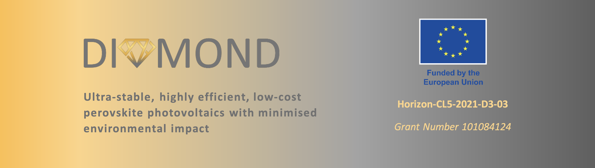
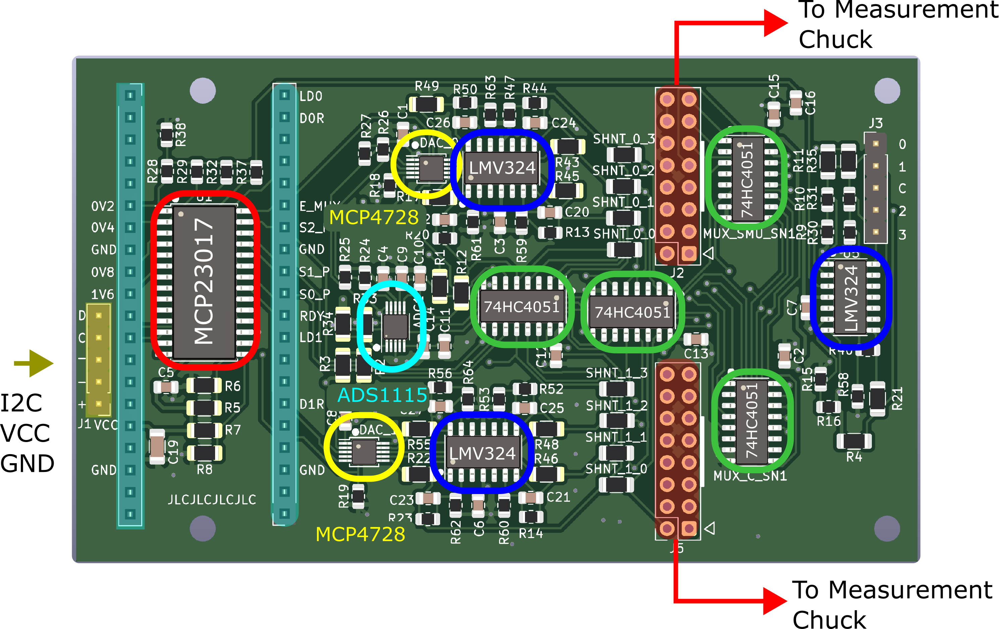
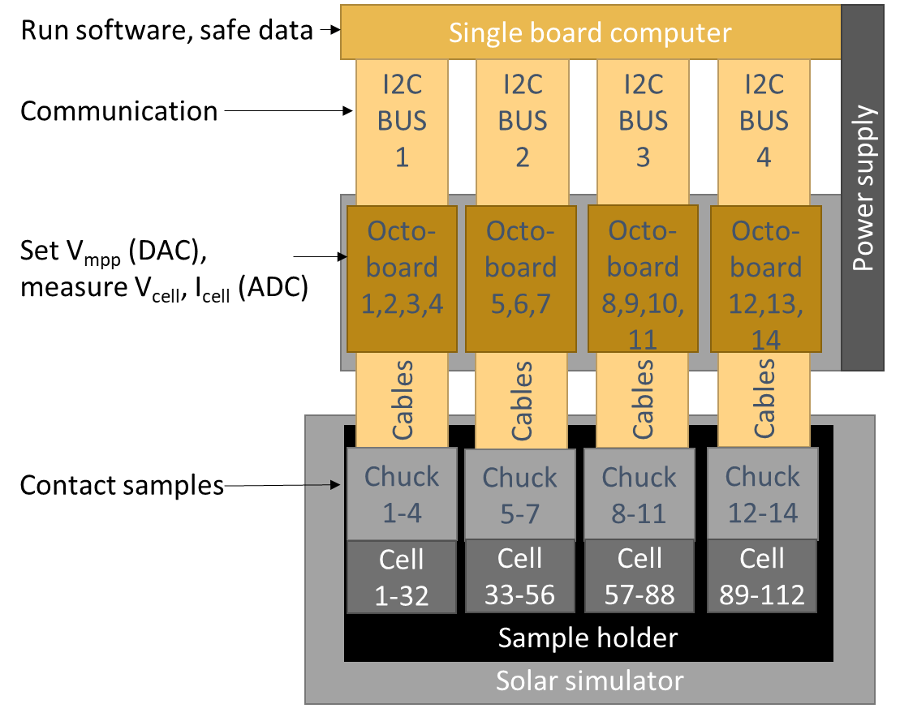

<a href="https://diamond-horizon.eu/">
  
</a>

# Maximum Power Point Tracker for Research-Level Solar Cells

## Overview
This repository documents the design, implementation, and operation of a massively parallel, low-cost Maximum Power Point Tracker (MPPT) for aging and degradation studies of perovskite solar cells. The system integrates custom-designed PCBs and software for efficient tracking and data logging.

## Features
- **Hardware**:

  Measurement Chuck
   - Allows up to 10 substrates (40 solar cells) to be aged in a nitrogen atmosphere.
   - Compact design: Simultaneous testing of 8 chucks corresponding to 80 substrates (480 cells) within a single sun simulator.  
   - Easy Sample Replacement: Single chucks within the setup can be exchanged during ongoing measurements without breaking the nitrogen atmosphere or interrupting the other measurements within the same sun simulator.  

  Octoboards (`Custom-designed PCBs`) for Source Measure Unit (SMU) functions
  - 8 channels per board
  - Modular and scalable design
  - Support for multiple boards via I2C addressing

- **Software**: Python-based control system
  - Efficient MPP tracking algorithm
  - Real-time data logging to CSV
  - Multi-board management
- **Integration**: Full Raspberry Pi compatibility for control and data acquisition

## Repository Structure
```plaintext
├── docs/
│   ├── images/
│   │   ├── EU_logo.png
│   │   ├── EU_logo_funding.png
│   │   ├── diamond_header.png
│   │   ├── octoboard.png
│   │   └── system.png
│   └── D5.2_100_ch_MPP_tracker.pdf
├── hardware/
│   ├── Measurement Chuck Housing CAD Design/
│   │   ├── Assembly.iam 
│   │   ├── Assembly.ipj 
│   │   ├── Bauteil4.ipt 
│   │   ├── Bauteil5.ipt
│   │   ├── Bauteil6.ipt
│   │   ├── chuck_v1.ipt
│   │   ├── DIN_EN_ISO_2338-3_h8x16.ipt 
│   │   ├── DIN_EN_ISO_4762-M2x3.ipt 
│   │   ├── DIN_EN_ISO_4762-M3x5.ipt 
│   │   ├── DIN_EN_ISO_4762-M3x10.ipt 
│   │   ├── DIN_EN_ISO_4762-M3x20.ipt 
│   │   ├── DIN_EN_ISO_7046-2_Z-M2.5x10-8.8-Z1.ipt 
│   │   ├── Glasscheibe.ipt 
│   │   ├── Glassubstrat_25x25x2.2.ipt 
│   │   └── Maske.ipt
│   ├── Measurement Chuck PCB Design/
│   │   ├── SubSheet.kicad_sch
│   │   ├── BOM.csv
│   │   ├── chuck_v1.dsn
│   │   ├── chuck_v1.kicad_pcb
│   │   ├── chuck_v1.kicad_prl
│   │   ├── chuck_v1.kicad_pro
│   │   ├── chuck_v1.kicad_sch
│   │   ├── CPL.csv
│   │   └── gerber.zip
│   ├── Octoboard PCB Design/
│   │   ├── DAC.kicad_sch
│   │   ├── octoboard.kicad_pcb
│   │   ├── octoboard.kicad_prl
│   │   ├── octoboard.kicad_pro
│   │   └── octoboard.kicad_sch
├── software/
│   ├── hardware/
│   │   ├── __init__.py
│   │   ├── channel.py
│   │   ├── constants.py
│   │   ├── i2c.py
│   │   ├── manager.py
│   │   ├── oboard.py
│   │   └── sdac.py
│   ├── tests/
│   │   ├── test_hardware.py
│   │   ├── test_logger.py
│   │   └── test_tracker.py
│   ├── __init__.py
│   ├── cli.py
│   ├── logger.py
│   ├── requirements.txt
│   └── setup.py
└── README.md
```

## Documentation

### 1. Hardware

#### **1.1 Octoboard**
The Octoboard is a custom-designed PCB that forms the core of the MPPT system, providing capabilities for maximum power point tracking in solar cell testing and evaluation.

**Key Components:**
- **MCP23017**: 16-bit I2C I/O expander for digital control
- **MCP4728**: 4-channel DAC for voltage control
- **ADS1115**: 16-bit ADC for precision measurement
- **LMV324**: Quad operational amplifiers for signal conditioning
- **74HC4051**: Analog multiplexers for efficient channel selection



#### Component Specifications

| Component | Type | Key Specifications | Datasheet |
|-----------|------|-------------------|-----------|
| MCP4728 | DAC | 12-bit, 4-channel, I2C | [Datasheet](http://ww1.microchip.com/downloads/en/devicedoc/22187e.pdf) |
| ADS1115 | ADC | 16-bit, 4-channel, I2C | [Datasheet](https://www.ti.com/lit/gpn/ads1115) |
| LMV324 | Op-Amp | Rail-to-rail, low power | [Datasheet](https://www.onsemi.com/download/data-sheet/pdf/lmv321-d.pdf) |
| 74HC4051 | Multiplexer | 8-channel analog | [Datasheet](https://assets.nexperia.com/documents/data-sheet/74HC_HCT4051.pdf) |
| MCP23017 | I/O Expander | 16-bit, I2C | [Datasheet](https://ww1.microchip.com/downloads/aemDocuments/documents/APID/ProductDocuments/DataSheets/MCP23017-Data-Sheet-DS20001952.pdf) |

#### System Architecture
The MPPT system is designed with a hierarchical structure:
1. Central Raspberry Pi controller
2. Multiple Octoboards (8 channels each)
3. I2C communication backbone
4. Integrated sample holder with thermal management



#### **1.2 Measurement Chuck**
The Measurement Chuck allows up to 10 substrates (40 solar cells) to be aged under a nitrogen atmosphere.
Due to its compact design, up to eight measurement chucks can be fit in a Solaronix SOLIXON A-45 solar simulator. 

**Operation & Handling**
To replace the substrates inside a chuck:
1. Disconnect the flat ribbon cables and nitrogen supply hoses (quick-connect couplings ensure that the remaining substrates stay in an N₂ atmosphere).
2. Transfer the chuck to a glovebox, where the cells can be exchanged by loosening the screws as shown in the video below.
3. Reinsert the newly equipped chuck into the sun simulator and attach it to the cables and supply hoses. 

<div style="display: flex; justify-content: flex-start;">
    
</div>

### 2. Software

#### Installation

1. Clone the repository:
```bash
git clone https://github.com/H2020DiamondEU/octoboard.git
cd octoboard
```

2. Install dependencies:
```bash
pip install -r software/requirements.txt
```

3. Install the package:
```bash
pip install -e .
```

#### Usage

1. Basic operation:
```python
from software import OBoardManager

# Initialize manager with I2C bus number
manager = OBoardManager(i2c_num=1)

# Start MPP tracking on all channels
manager.cycle_all_channels(iterations_per_channel=10)
```

2. Command-line interface:
```bash
python -m software.cli 1  # Start tracking on I2C bus 1
```

### 3. Data Management

Data is stored in CSV format with the following structure:
- Location: `data/[board_id]_channel_[n]_data.csv`
- Format: timestamp, voltage, current, power, temperature

### 4. Troubleshooting

Common issues and solutions:
1. I2C Communication Errors
   - Check bus number and device addresses
   - Verify cable connections
   - Check for address conflicts

2. Measurement Instability
   - Verify power supply stability
   - Check contact resistance

## License
This project is licensed under the MIT License. See `LICENSE` for details.

## Links
- [Project Website](https://diamond-horizon.eu/)
- [European Commission Project Page](https://cordis.europa.eu/project/id/101084124)
- [Deliverable Documentation](https://ec.europa.eu/research/participants/documents/downloadPublic?documentIds=080166e50d1470c5&appId=PPGMS)

## Contact
For further information on integrating this measurement system into your PV lab, please contact:
- **Lukas Wagner**, AG Solare Energiekonversion University of Marburg,  lukas.wagner@physik.uni-marburg.de
- **Clemens Baretzky**, Fraunhofer ISE, clemens.baretzky@ise.fraunhofer.de

## Acknowledgments
This design was developed at the **University of Marburg** and **Fraunhofer ISE**.
The project is funded by the European Union in the Horizon 2.5. Climate, Energy and Mobility programme under Grant Agreement No. 101084124. Views and opinions expressed are however those of the author(s) only and do not necessarily reflect those of the European Union. Neither the European Union nor the granting authority can be held responsible for them.

<div style="display: flex; justify-content: flex-start;">
    
</div>
